# Environment Setup

## Table of Contents
- [1. Access the VSCode instance](#1-skip-if-in-aws-event-access-the-vscode-instance)
- [3. Installing Solace Agent Mesh](#3-installing-solace-agent-mesh)
- [4. Configuring Solace Agent Mesh](#4-configuring-solace-agent-mesh)
- [5. Adding prompts to SAM](#5-adding-prompts-to-sam)
- [Next Steps](#next-steps)

## 1. [Skip if in AWS Event] Access the VSCode instance
1. Navigate to the AWS Console

   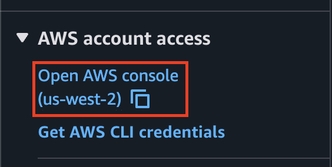

1. Access the Cloudformation Service

   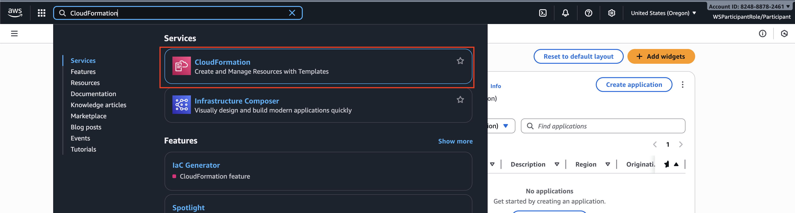

1. Click on the VsCode Stack

   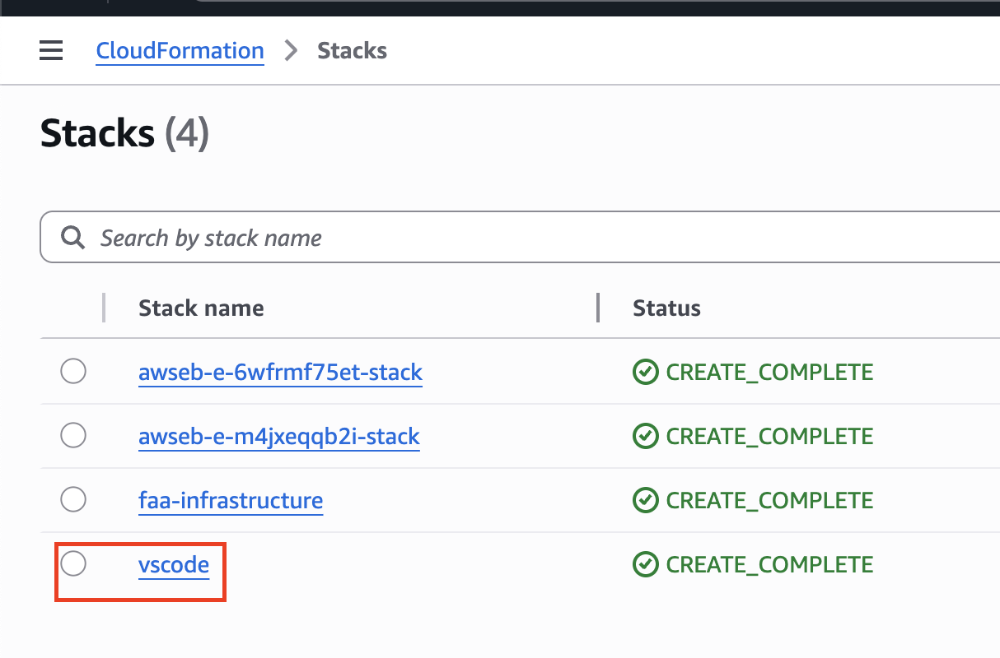

1. Look for the CloudFormation stack outputs section

   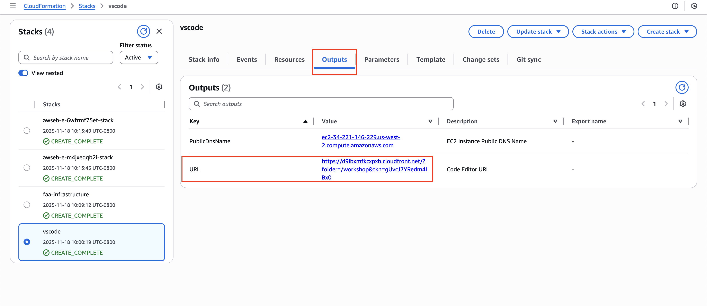

1. Open the VsCode in a new tab

   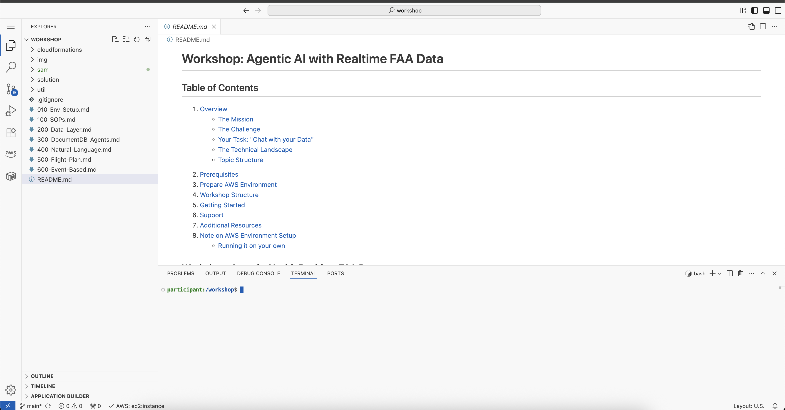

> Note: At any point during the workshop, if you kill your terminal window and want to bring it up again click `CMD+SHIT+P` to bring up the command pallet and type in `toggle terminal`

## 2. Installing Solace Agent Mesh

1. Navigate to the sam directory and create a virtual environment
   ```
   cd sam
   python3 -m venv .venv
   ```
1. Activate the virtual environment
   ```
   source .venv/bin/activate
   ```
1. Install the requirements
   ```
   pip install -r requirements.txt
   ```
   > Make sure you have activated your virtual environment before proceeding with the workshop. Run `source .venv/bin/activate` if you haven't already done so. Anytime you open a new terminal, you will have to navigate to the `sam` dir and activate the python virtual environment

1. Initialize the solace agent mesh
   ```
   sam init --skip
   ```
After initializing sam, you should now see a 
   ```
   .
   ├── configs
   │   ├── agents
   │   │   └── main_orchestrator.yaml
   │   ├── gateways
   │   │   └── webui.yaml
   │   ├── logging_config.yaml
   │   └── shared_config.yaml
   ├── requirements.txt
   └── src
      └── __init__.py
   5 directories, 6 files
   ```

## 3. Configuring Solace Agent Mesh

1. Replace everything in the `.env` with the following content
   ```
   NAMESPACE="faa/"
   SOLACE_BROKER_URL="ws://<solace_ec2_endpoint>:8008" # e.g. ws://ec2-35-90-45-100.us-west-2.compute.amazonaws.com:8008
   SOLACE_BROKER_VPN="default"
   SOLACE_BROKER_USERNAME="default"
   SOLACE_BROKER_PASSWORD="default"
   SOLACE_DEV_MODE="false"
   SESSION_SECRET_KEY="supersecretpassword"
   FASTAPI_HOST="0.0.0.0"
   FASTAPI_PORT="8000"
   FASTAPI_HTTPS_PORT="8443"
   SSL_KEYFILE=""
   SSL_CERTFILE=""
   SSL_KEYFILE_PASSWORD=""
   ENABLE_EMBED_RESOLUTION="True"
   S3_BUCKET_NAME=""
   S3_ENDPOINT_URL=""
   S3_REGION="us-west-2"

   ## AWS Bedrock Configuration
   AWS_ACCESS_KEY_ID="<insert_here>"
   AWS_SECRET_ACCESS_KEY="<insert_here>"
   AWS_SESSION_TOKEN="<insert_here>"
   BEDROCK_MODEL_NAME="bedrock/anthropic.claude-sonnet-4-20250514-v1:0"
   BEDROCK_MODEL_ID="<model_arn>" # e.g. arn:aws:bedrock:us-west-2:{AWS_ACCOUNT_ID}:inference-profile/global.anthropic.claude-sonnet-4-20250514-v1:0 
   ```

1. Update the necessary variables as follows:
   - `SOLACE_BROKER_URL` - Get the url from the cloud formation output. NOTE: Make sure to remote the `https://` and the port `:8080` from the url
      
      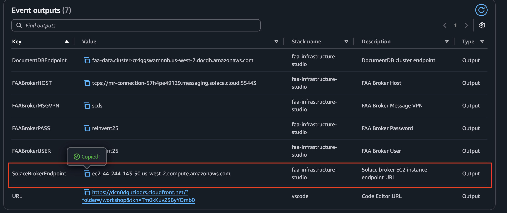

   - `AWS_ACCESS_KEY_ID`, `AWS_SECRET_ACCESS_KEY`, `AWS_SESSION_TOKEN` 

      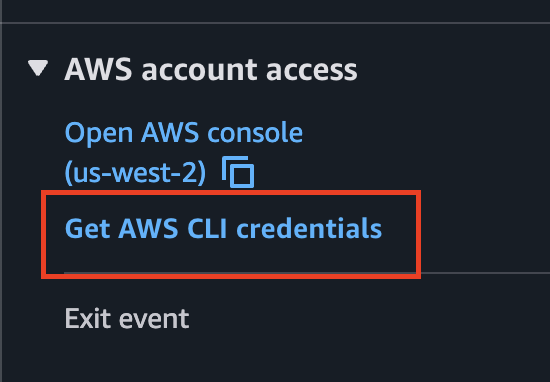

      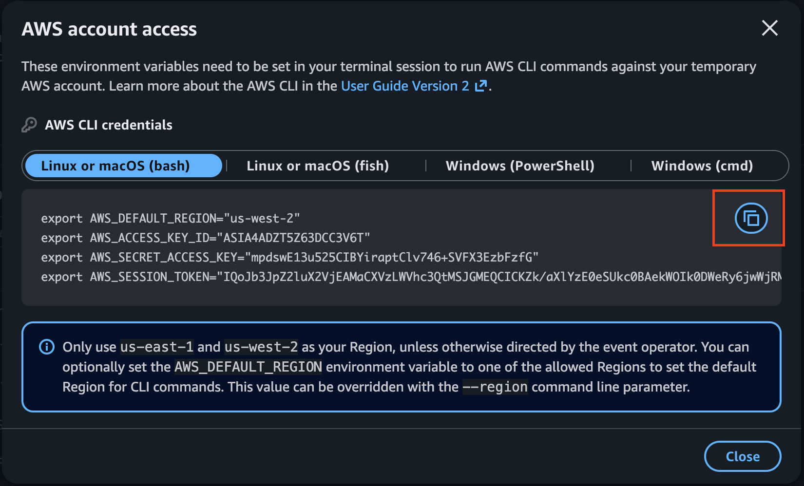

   - `BEDROCK_MODEL_ID`

      1. Navigate to the AWS Console

      

      1. Navigate to the Bedrock Service
      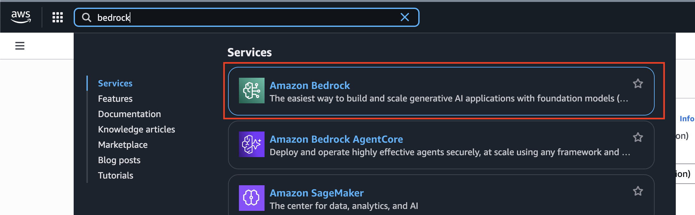

      1. Click on `Cross-region inference` from the Infer menu    
      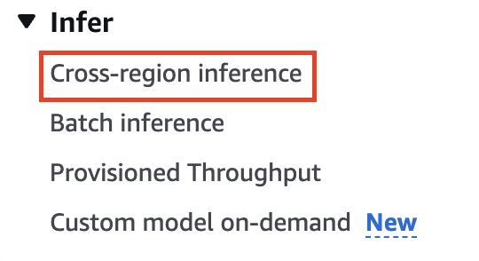

      1. Search for `claude-sonnet-4` under Inference profile
      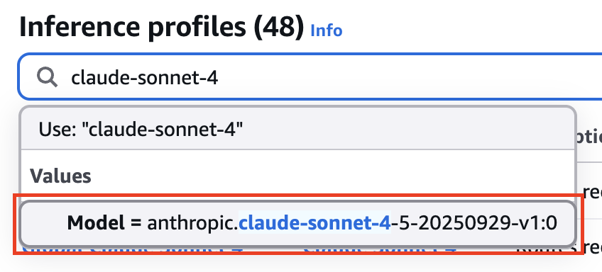

      1. Copy the _Inference profile ARN_ for the _Global Claude Sonnet 4.5_ model
      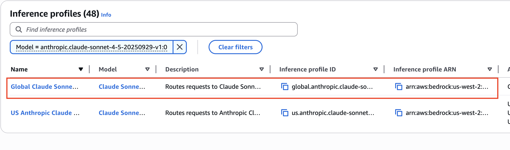
      
      1. Click the copy to clipboard icon    
      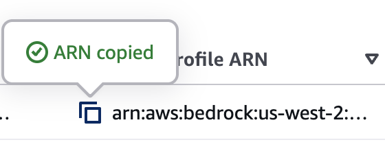

1. Save the `.env` file

1. Now update the model in the [shared configuration file](./sam/configs/shared_config.yaml) to use your bedrock hosted LLM at `configs/shared_config.yaml`. Replace your `planning` and `general` models with the following. IMPORTANT NOTE: make sure you have the correct YAML indentation if you copy paste the following content.

   ```
   planning: &planning_model
      model: ${BEDROCK_MODEL_NAME}
      model_id: ${BEDROCK_MODEL_ID}
      aws_access_key_id: ${AWS_ACCESS_KEY_ID}
      aws_secret_access_key: ${AWS_SECRET_ACCESS_KEY}
      aws_session_token: ${AWS_SESSION_TOKEN}
      temperature: 0.1  # Lower temperature for more focused responses
      # max_tokens: 2048  # Limit response length
    
   general: &general_model
      model: ${BEDROCK_MODEL_NAME}
      model_id: ${BEDROCK_MODEL_ID}
      aws_access_key_id: ${AWS_ACCESS_KEY_ID}
      aws_secret_access_key: ${AWS_SECRET_ACCESS_KEY}
      aws_session_token: ${AWS_SESSION_TOKEN}
      temperature: 0.1  # Lower temperature for more focused responses
      # max_tokens: 1536  # Limit response length for general queries
   ```
Your shared_config.yaml file should look like this
   ```
   shared_config:
  - broker_connection: &broker_connection
      dev_mode: ${SOLACE_DEV_MODE, false}
      broker_url: ${SOLACE_BROKER_URL, ws://localhost:8008}
      broker_username: ${SOLACE_BROKER_USERNAME, default}
      broker_password: ${SOLACE_BROKER_PASSWORD, default}
      broker_vpn: ${SOLACE_BROKER_VPN, default}
      temporary_queue: ${USE_TEMPORARY_QUEUES, true}
      

  - models:
    planning: &planning_model
      model: ${BEDROCK_MODEL_NAME}
      model_id: ${BEDROCK_MODEL_ID}
      aws_access_key_id: ${AWS_ACCESS_KEY_ID}
      aws_secret_access_key: ${AWS_SECRET_ACCESS_KEY}
      aws_session_token: ${AWS_SESSION_TOKEN}
      temperature: 0.1  # Lower temperature for more focused responses
      # max_tokens: 2048  # Limit response length

    general: &general_model
      model: ${BEDROCK_MODEL_NAME}
      model_id: ${BEDROCK_MODEL_ID}
      aws_access_key_id: ${AWS_ACCESS_KEY_ID}
      aws_secret_access_key: ${AWS_SECRET_ACCESS_KEY}
      aws_session_token: ${AWS_SESSION_TOKEN}
      temperature: 0.1  # Lower temperature for more focused responses
      # max_tokens: 1536  # Limit response length for general queries

    image_gen: &image_generation_model
      # This dictionary structure tells ADK to use the LiteLlm wrapper.
      # 'model' uses the specific model identifier your endpoint expects.
      model: ${IMAGE_MODEL_NAME} # Use env var for model name
      # 'api_base' tells LiteLLM where to send the request.
      api_base: ${IMAGE_SERVICE_ENDPOINT} # Use env var for endpoint URL
      # 'api_key' provides authentication.
      api_key: ${IMAGE_SERVICE_API_KEY} # Use env var for API key

    report_gen: &report_generation_model
      # This dictionary structure tells ADK to use the LiteLlm wrapper.
      # 'model' uses the specific model identifier your endpoint expects.
      model: ${LLM_REPORT_MODEL_NAME} # Use env var for model name
      # 'api_base' tells LiteLLM where to send the request.
      api_base: ${LLM_SERVICE_ENDPOINT} # Use env var for endpoint URL
      # 'api_key' provides authentication.
      api_key: ${LLM_SERVICE_API_KEY} # Use env var for API key

    multimodal: &multimodal_model  "gemini-2.5-flash-preview-04-17"

    # OAuth 2.0 Client Credentials authentication example
    oauth_planning: &oauth_planning_model
      # This dictionary structure tells ADK to use the LiteLlm wrapper with OAuth authentication.
      # 'model' uses the specific model identifier your endpoint expects.
      model: ${LLM_SERVICE_OAUTH_PLANNING_MODEL_NAME} # Use env var for model name
      # 'api_base' tells LiteLLM where to send the request.
      api_base: ${LLM_SERVICE_OAUTH_ENDPOINT} # Use env var for endpoint URL

      # OAuth 2.0 Client Credentials configuration
      oauth_token_url: ${LLM_SERVICE_OAUTH_TOKEN_URL} # OAuth token endpoint URL
      oauth_client_id: ${LLM_SERVICE_OAUTH_CLIENT_ID} # OAuth client identifier
      oauth_client_secret: ${LLM_SERVICE_OAUTH_CLIENT_SECRET} # OAuth client secret
      oauth_scope: ${LLM_SERVICE_OAUTH_SCOPE} # Optional: OAuth scope (space-separated)
      # oauth_ca_cert: ${LLM_SERVICE_OAUTH_CA_CERT_PATH} # Optional: Custom CA certificate path
      oauth_token_refresh_buffer_seconds: ${LLM_SERVICE_OAUTH_TOKEN_REFRESH_BUFFER_SECONDS, 300} # Refresh buffer

      # Enable parallel tool calls for planning model
      parallel_tool_calls: true
      # max_tokens: ${MAX_TOKENS, 16000} # Set a reasonable max token limit for planning
      # temperature: 0.1 # Lower temperature for more deterministic planning

    oauth_general: &oauth_general_model
      # This dictionary structure tells ADK to use the LiteLlm wrapper with OAuth authentication.
      # 'model' uses the specific model identifier your endpoint expects.
      model: ${LLM_SERVICE_OAUTH_GENERAL_MODEL_NAME} # Use env var for model name
      # 'api_base' tells LiteLLM where to send the request.
      api_base: ${LLM_SERVICE_OAUTH_ENDPOINT} # Use env var for endpoint URL

      # OAuth 2.0 Client Credentials configuration
      oauth_token_url: ${LLM_SERVICE_OAUTH_TOKEN_URL} # OAuth token endpoint URL
      oauth_client_id: ${LLM_SERVICE_OAUTH_CLIENT_ID} # OAuth client identifier
      oauth_client_secret: ${LLM_SERVICE_OAUTH_CLIENT_SECRET} # OAuth client secret
      oauth_scope: ${LLM_SERVICE_OAUTH_SCOPE} # Optional: OAuth scope (space-separated)
      # oauth_ca_cert: ${LLM_SERVICE_OAUTH_CA_CERT_PATH} # Optional: Custom CA certificate path
      oauth_token_refresh_buffer_seconds: ${LLM_SERVICE_OAUTH_TOKEN_REFRESH_BUFFER_SECONDS, 300} # Refresh buffer

  - services:
    # Default session service configuration
    session_service: &default_session_service
      type: "memory"
      default_behavior: "PERSISTENT"
    
    # Default artifact service configuration
    artifact_service: &default_artifact_service
      type: "filesystem"
      base_path: "/tmp/samv2"
      artifact_scope: namespace
    
    # Default data tools configuration
    data_tools_config: &default_data_tools_config
      sqlite_memory_threshold_mb: 100
      max_result_preview_rows: 50
      max_result_preview_bytes: 4096
   ```
1. From terminal, run sam `sam run`
   
   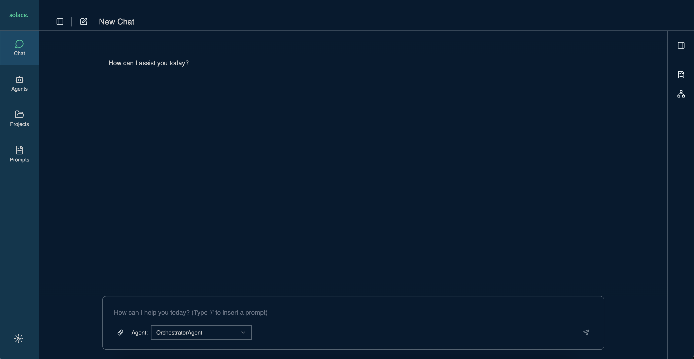

1. Navigate to the sam web UI. Note you can get the URL from the cloudformation output

   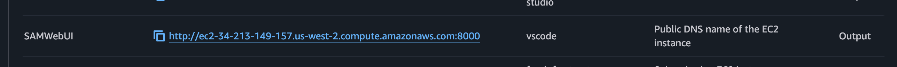

   Note: Make sure you access the web UI on port 8000 `http://${SAMWebUIEndPoint}:8000`

1. You can now interact with the Solace Agent Mesh WebUI

   

1. Test out your LLM configuration with the following prompt
   ```
   What model are you using?
   ```

   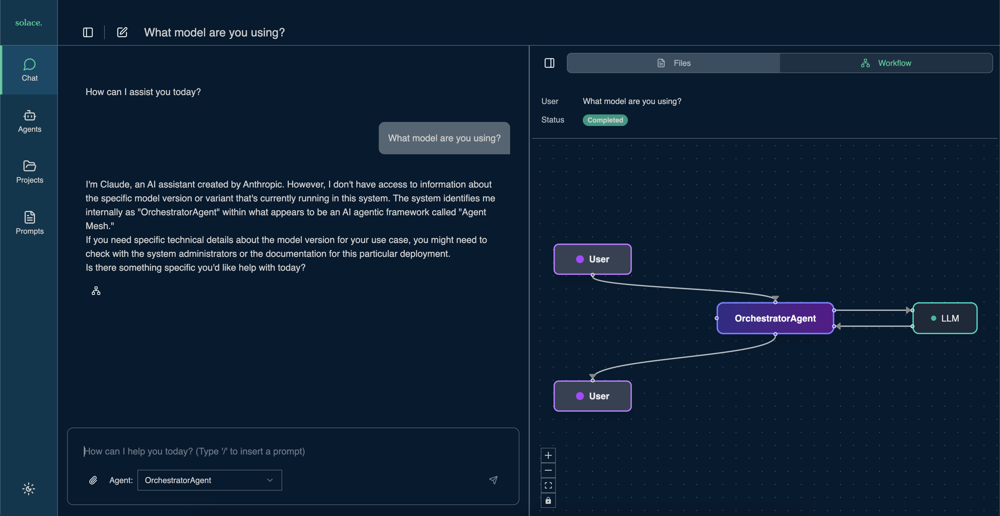

   > Note: You can view the prompt workflow by clicking this icon
   >
   >   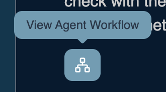
      
## 4. Adding prompts to SAM
Now lets pre-populate the solace agent mesh instance with prompts:

1. open a new terminal

   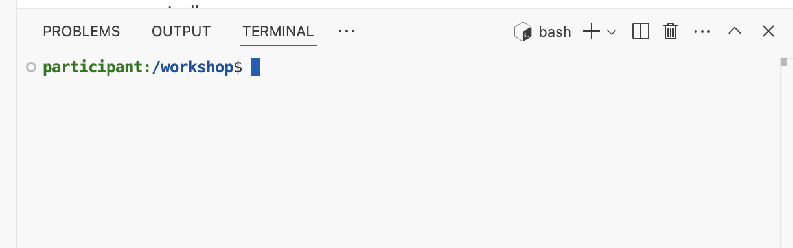

1. Run the following script
   ```
   python3 util/populate_prompts.py --file util/faa_prompts.json
   ```

## Next Steps
Now you can follow the workshop parts in order, starting with [Standard Operating Procedures](100-SOPs.md)
