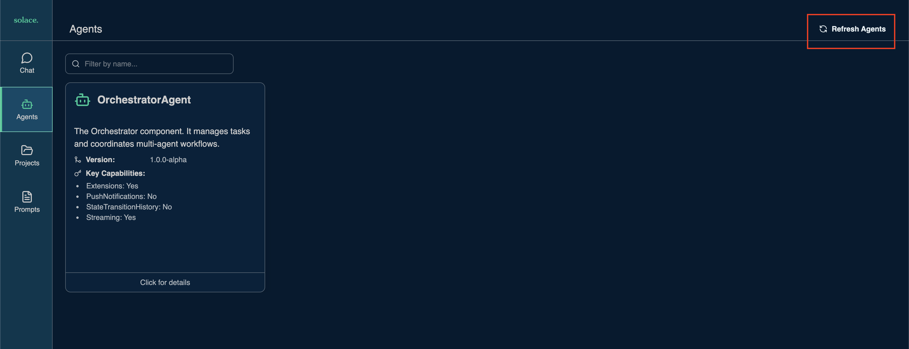
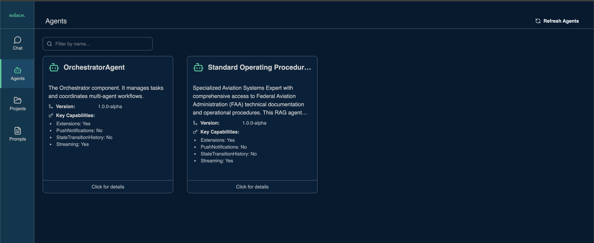
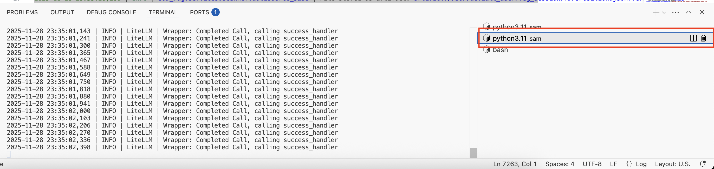
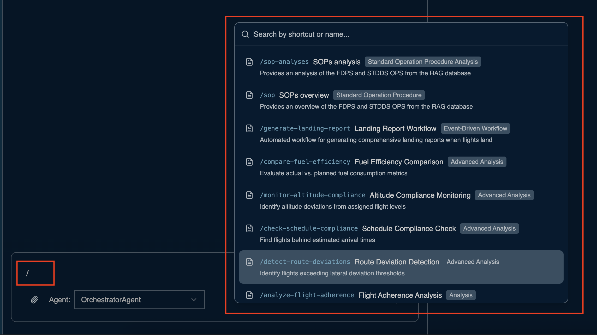
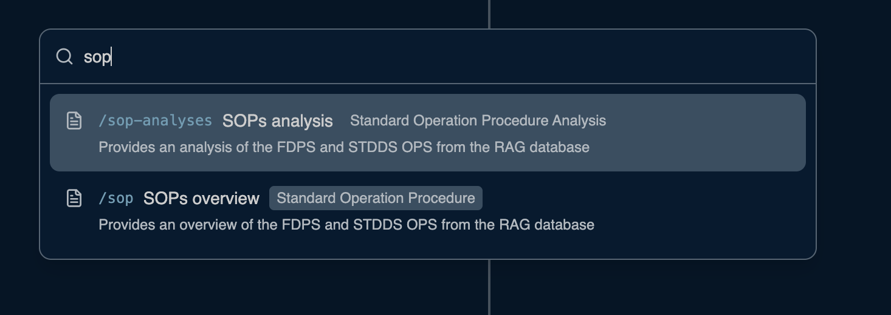
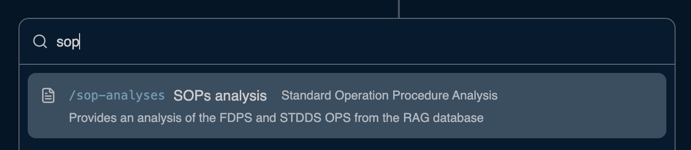
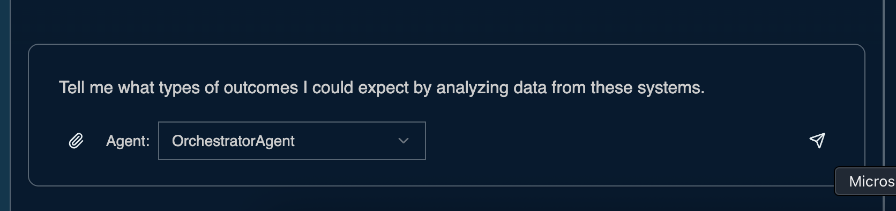

# Table of Contents

1. [Introduction to FAA Systems](#introduction-to-faa-systems)
   - [FDPS (Flight Data Processing System)](#fdps-flight-data-processing-system)
   - [STDDS (Surface Data Distribution System)](#stdds-surface-data-distribution-system)
2. [Understanding System Documentation with RAG](#understanding-system-documentation-with-rag)
3. [Exercise: Create a RAG agent](#exercise-create-a-rag-agent)
   - [Step 1: Add the RAG Plugin](#step-1-add-the-rag-plugin)
   - [Step 2: Configure the RAG Agent](#step-2-configure-the-rag-agent)
   - [Step 3: Set Up Environment Variables](#step-3-set-up-environment-variables)
   - [Step 4: Create Document Directory](#step-4-create-document-directory)
   - [Step 5: Run the RAG Agent](#step-5-run-the-rag-agent)
   - [Step 6: Verify Agent Setup](#step-6-verify-agent-setup)
4. [Exercise: Analyzing System Documentation](#exercise-analyzing-system-documentation)
   - [Step 1: Upload CONOPS Documents](#step-1-upload-conops-documents)
   - [Step 2: Query the RAG Agent](#step-2-query-the-rag-agent)
5. [Next Steps](#next-steps) The Data Streams - FDPS, STDDS, and RAG

## Introduction to FAA Systems

In this workshop, we'll work with two critical FAA data systems:

### FDPS (Flight Data Processing System)

FDPS is the FAA's primary system for managing flight plan data and tracking aircraft through the National Airspace System (NAS). It processes flight plans, monitors aircraft positions, and coordinates handoffs between air traffic control facilities.

### STDDS (Surface Data Distribution System)

STDDS provides real-time information about aircraft movements on airport surfaces, including taxiways, runways, and ramps. This system is crucial for ground traffic management and preventing runway incursions.

## Understanding System Documentation with RAG

In a real FAA project, each system comes with extensive CONOPS (Concept of Operations) documentation—often exceeding 200 pages per system. We'll use Agent Mesh's RAG (Retrieval-Augmented Generation) capabilities to extract relevant information.

## Exercise: Create a RAG agent

In this exercise, you'll set up a Retrieval Augmented Generation (RAG) agent that can ingest, process, and answer questions about FAA system documentation.

### Step 1: Add the RAG Plugin

1. Open a new terminal session
   

1. Navigate to the `sam` directory and activate the python virtual environment
   ```
   cd sam
   source .venv/bin/activate
   ```

1. Run the following command to add the RAG plugin:

```sh
sam plugin add faa-docs-agent --plugin sam-rag
```

1. This will create a new agent configuration file at [configs/agents/faa-docs-agent.yaml](./sam/configs/agents/faa-docs-agent.yaml)

### Step 2: Configure the RAG Agent

1. Uncomment `!include ../shared_config.yaml` on line 15

1. Since we are importing a shared configuration, remove the `shared_config:` block from line 17 - 46

1. Open `configs/agents/faa-docs-agent.yaml` in your editor and understand the following sections:

   - Scanner Configuration
   - Preprocessor Configuration
   - Splitter Configuration
   - Embedding Configuration
   - Vector Database Configuration
   - LLM Configuration
   - Retrieval Configuration

1. Update `app_config.instructions`
   ```
   You are an Aviation Technical Documentation Specialist with access to a comprehensive knowledge base of Federal Aviation Administration (FAA) systems and operational procedures. Your role is to provide expert-level technical guidance, specifications, and operational context for aviation professionals working with FAA data systems.

        Response Guidelines:
        - Provide concise, accurate answers focused on the specific question asked
        - Include only essential technical details unless comprehensive coverage is specifically requested
        - Use bullet points or structured formats for clarity when listing information
        - Avoid repetitive explanations of basic concepts unless the user is clearly a beginner
        - When searching documents, extract and present only the most relevant information

        You can ingest documents and retrieve relevant information.
        You can search for information in the ingested documents and provide augmented responses.
        Use the 'ingest_document' tool to add new documents to the system.
        Use the 'search_documents' tool to find relevant information based on user queries.
        Utilize this agent for any technical questions related to FAA aviation systems, flight data processing, airport surface operations, or SWIM data integration. The agent provides authoritative, technically accurate responses based on official FAA documentation and operational procedures.
   ```
   > Note: description should be properly indented

1. Update the `agent_card.description`
   ```
   Specialized Aviation Systems Expert with comprehensive access to Federal Aviation Administration (FAA) technical documentation and operational procedures. This RAG agent serves as an authoritative source for aviation professionals requiring detailed technical guidance on FAA data systems, flight operations, and airport surface management.
   ```
   > Note: description should be properly indented


1.Update `agent_card.skills.id: "document_retrieval"`
   ```
    - id: "document_retrieval"
      name: "Document Retrieval"
      description: "Provide context about aviation and faa data. This includes information about enroute flights, the format and structure of the data"
      examples:
         - "What is the structure of the FDPSPosition collection in a JSON Schema format"
         - "Find documents related to machine learning algorithms."
   ```
   > Note: skills should be properly indented

1. Configure the agent to use AWS Bedrock Embedding Model

   ```
   embedding:
      embedder_type: "litellm"
      embedder_params:
         model: "${BEDROCK_EMBEDDING_MODEL_NAME}"
         batch_size: 32
         additional_kwargs:
            aws_access_key_id: "${AWS_ACCESS_KEY_ID}"
            aws_secret_access_key: "${AWS_SECRET_ACCESS_KEY}"
      normalize_embeddings: true
   ```

Your final Agent yaml configuration should look like this
```
# This is a configuration template for the SAM RAG Agent Plugin.
#
# Plugin Metadata:
# Name: sam-rag-agent
# Version: 0.1.0
# Description: This plugin allows you to import one RAG agent as action to be used in your SAM project.
# Author: SolaceLabs <solacelabs@solace.com>

log:
  stdout_log_level: INFO
  log_file_level: INFO
  log_file: faa-docs-agent.log

# To use the `shared_config.yaml` file, uncomment the following line and remove the `shared_config` section below.
!include ../shared_config.yaml


apps:
  - name: sop-rag-app
    app_module: solace_agent_mesh.agent.sac.app
    broker:
      <<: *broker_connection
    app_config:
      namespace: "${NAMESPACE}" # Your A2A topic namespace
      agent_name: "SOP"
      display_name: "Standard Operating Procedures RAG Agent"
      supports_streaming: true # RAG agent supports streaming responses

      model: *general_model
      instruction: |
        You are an Aviation Technical Documentation Specialist with access to a comprehensive knowledge base of Federal Aviation Administration (FAA) systems and operational procedures. Your role is to provide expert-level technical guidance, specifications, and operational context for aviation professionals working with FAA data systems.

        Response Guidelines:
        - Provide concise, accurate answers focused on the specific question asked
        - Include only essential technical details unless comprehensive coverage is specifically requested
        - Use bullet points or structured formats for clarity when listing information
        - Avoid repetitive explanations of basic concepts unless the user is clearly a beginner
        - When searching documents, extract and present only the most relevant information

        You can ingest documents and retrieve relevant information.
        You can search for information in the ingested documents and provide augmented responses.
        Use the 'ingest_document' tool to add new documents to the system.
        Use the 'search_documents' tool to find relevant information based on user queries.
        Utilize this agent for any technical questions related to FAA aviation systems, flight data processing, airport surface operations, or SWIM data integration. The agent provides authoritative, technically accurate responses based on official FAA documentation and operational procedures.

      # --- Configurable Agent Initialization & Cleanup ---
      agent_init_function:
        module: "sam_rag.lifecycle"
        name: "initialize_rag_agent"
        config:
          scanner:
            batch: true
            use_memory_storage: true
            sources:
              - type: filesystem
                directories:
                  - "${DOCUMENTS_PATH}" # Path to documents directory
                filters:
                  file_formats:
                    - ".txt"
                    - ".pdf"
                    - ".docx"
                    - ".md"
                    - ".html"
                    - ".csv"
                    - ".json"
                  max_file_size: 10240  # in KB (10MB)
                schedule:
                  interval: 60 # seconds

          # Text splitter configuration
          splitter:
            default:
              method: CharacterTextSplitter
              params:
                chunk_size: 2048 # minimum chunk size
                chunk_overlap: 800
                separator: " "
            splitters:
              # Text file configurations
              text:
                method: CharacterTextSplitter
                params:
                  chunk_size: 2048 # minimum chunk size
                  chunk_overlap: 800
                  separator: " "
                  is_separator_regex: false
                  keep_separator: true
                  strip_whitespace: true
              txt:
                method: CharacterTextSplitter
                params:
                  chunk_size: 2048 # minimum chunk size
                  chunk_overlap: 800
                  separator: "\n"
                  is_separator_regex: false
                  keep_separator: true
                  strip_whitespace: true
              # Structured data configurations
              json:
                method: RecursiveJSONSplitter
                params:
                  chunk_size: 200
                  chunk_overlap: 50
              html:
                method: HTMLSplitter
                params:
                  chunk_size: 2048
                  chunk_overlap: 800
                  tags_to_extract: ["p", "h1", "h2", "h3", "li"]
              markdown:
                method: MarkdownSplitter
                params:
                  chunk_size: 2048
                  chunk_overlap: 800
                  headers_to_split_on: ["#", "##", "###", "####", "#####", "######"]
                  strip_headers: false
              csv:
                method: CSVSplitter
                params:
                  chunk_size: 2048 # chunk size in number of rows
                  include_header: false
                # Add Xml, Odt, Xlsx, and other formats as needed
          # Embedding configuration

          embedding:
            embedder_type: "litellm"
            embedder_params:
              model: "${BEDROCK_EMBEDDING_MODEL_NAME}"
              batch_size: 32
              additional_kwargs:
                aws_access_key_id: "${AWS_ACCESS_KEY_ID}"
                aws_secret_access_key: "${AWS_SECRET_ACCESS_KEY}"
            normalize_embeddings: true

          vector_db:
            db_type: "qdrant"
            db_params:
              url: "${QDRANT_URL}"
              api_key: "${QDRANT_API_KEY}"
              collection_name: "${QDRANT_COLLECTION}"
              embedding_dimension: ${QDRANT_EMBEDDING_DIMENSION}

          llm:
            load_balancer:
              - model_name: "gpt-4o"
                litellm_params:
                  model: openai/${OPENAI_MODEL_NAME}
                  api_key: ${OPENAI_API_KEY}
                  api_base: ${OPENAI_API_ENDPOINT}
                  temperature: 0.01

          retrieval:
            top_k: 5

      agent_cleanup_function:
        module: "sam_rag.lifecycle"
        name: "cleanup_rag_agent_resources"

      # --- ADK Tools Configuration ---
      tools:
        - tool_type: python
          component_module: "sam_rag.tools"
          function_name: "ingest_document"
          required_scopes: ["rag:ingest:write"]

        - tool_type: python
          component_module: "sam_rag.tools"
          function_name: "search_documents"
          required_scopes: ["rag:search:read"]


      session_service: *default_session_service
      artifact_service: *default_artifact_service

      # Enable built-in artifact tools only for complex outputs
      enable_builtin_artifact_tools:
        enabled: true
        artifact_threshold: 500  # Only create artifacts for responses > 500 chars

      # Agent Card, Discovery, and Inter-Agent Communication
      agent_card:
        description: "Specialized Aviation Systems Expert with comprehensive access to Federal Aviation Administration (FAA) technical documentation and operational procedures. This RAG agent serves as an authoritative source for aviation professionals requiring detailed technical guidance on FAA data systems, flight operations, and airport surface management."
        defaultInputModes: ["text", "file"]
        defaultOutputModes: ["text", "file"]
        skills:
          - id: "document_ingestion"
            name: "Document Ingestion"
            description: "Ingest documents from various sources into the RAG system."
            examples:
              - "Please ingest this document about climate change."
              - "Add this PDF to the knowledge base."
          - id: "document_retrieval"
            name: "Document Retrieval"
            description: "Provide context about aviation and faa data. This includes information about enroute flights, the format and structure of the data"
            examples:
              - "What is the structure of the FDPSPosition collection in a JSON Schema format"
              - "Find documents related to machine learning algorithms."

      agent_card_publishing:
        interval_seconds: 30

      agent_discovery:
        enabled: true

      inter_agent_communication:
        allow_list: []
        deny_list: []
        request_timeout_seconds: 60
```
### Step 3: Set Up Environment Variables

Update your `.env` file with the necessary variables. Your workshop instructor will provide the specific values for your environment. Note the `QDRANT_COLLECTION` has to be updated with a unique name

```
## Qdrant Configuration
QDRANT_URL="<qdrant_url>:6333"
QDRANT_API_KEY="<API_KEY>"
QDRANT_COLLECTION="SOP-YourNAME"
QDRANT_EMBEDDING_DIMENSION=1024
DOCUMENTS_PATH="faa_documents"
## AWS Bedrock Configuration
BEDROCK_EMBEDDING_MODEL_NAME="bedrock/amazon.titan-embed-text-v2:0"
```

Please refer to the cloudformation output for vectorDB endpoint and API key

### Step 4: Create Document Directory

1. Create a directory for your FAA documentation:

```sh
mkdir -p faa_documents
```

_This directory will be used in the next exercise to store the FDPS and STDDS CONOPS documents_

### Step 5: Run the RAG Agent

1. Start your RAG agent with the following command:

```sh
sam run configs/agents/faa-docs-agent.yaml
```

1. The agent will initialize and connect to your vector database.
1. It will be ready to scan and ingest documents in the next exercise.

### Step 6: Verify Agent Setup

1. Check the terminal output for any errors.

1. Verify that the agent has successfully connected to:
   - The Solace broker
   - The vector database

1. If you see any connection errors, double-check your environment variables and configuration.

1. Navigate to the Solace Agent Mesh WebUI

  

1. Click on _Refresh Agents_ tab

  

1. See the the newly added SOPs agent
  

## Exercise: Analyzing System Documentation

### Step 1: Upload CONOPS Documents

The RAG agent has two main functionalities

1. **Ingesting documents**: This is done in one of two ways:
  
    1. Directory Upload: Add files in the configured the directory path in the <agent_name>.yaml file and the agent ingests documents in background automatically.

    1. Solace Agent Mesh UI on the browser (by default http://localhost:8000), attach files to a query such as "ingest the attached document to RAG". This query persistently stores the attachments in file system and index them in vector database.

1. **Retrieving documents**: Sending prompts using a Solace Agent Mesh Gateway (e.g. WebUI) "search documents about and return a summary and referenced documents". It retrieves top similar documents and returns a summary of documents align with their original documents.

Now lets go ahead an upload our FAA standard operating procedures through a directory upload

1. Open a new terminal session

  

1. Execute these command

  ```
  cp solution/sop/SFDPS_Flight_Operational_Context_Document_v1.0_20180828_Final.md sam/faa_documents/
  cp solution/sop/STDDS_SMES_Operational_Context_Document_v1.1_2019_04_25_RevA.md sam/faa_documents/
  ```

  > This command copies all the FAA SOP documents into the configured RAG directory

1. [Optional] Navigate to the terminal session where the RAG agent is running and observe the embedding

  

### Step 2: Query the RAG Agent

Use the RAG agent to analyze the uploaded documentation by running the following prompts:

```
Tell me about the FDPS and STDDS systems and data.
```

Wait for the response and review the summary.

Using the prepopulated prompts, follow the next steps

1. From the chat interface, type `/` to insert a prompt

  

1. Type in `sop-`

  

1. Click on the `sops-analyses` prompt and hit enter

  

1. Execute the prompt

  

The RAG agent will provide:
- High-level overviews of each system's purpose and functionality
- Descriptions of the data structures and key fields
- Insights into potential analysis opportunities
- Relationships between the two systems

This approach is significantly more efficient than reading hundreds of pages of technical documentation manually.

## Next Steps

In the next part, we'll explore setting up the data layer for our workshop environment. We'll dive into the DocumentDB instance that serves as the foundation for our real-time flight data analysis.

[Continue to Setting Up the Data Layer](200-Data-Layer.md)