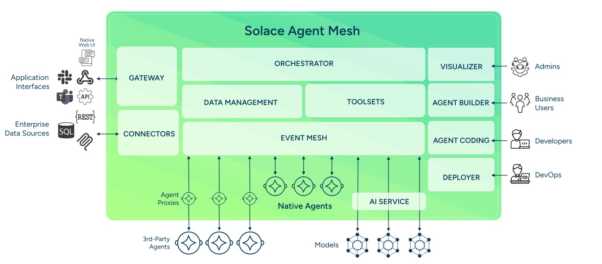
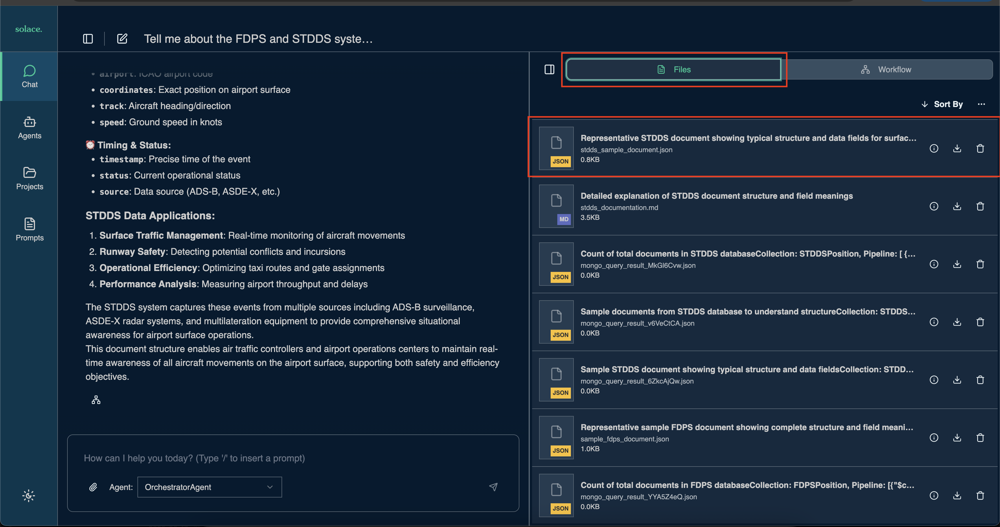

# Understanding Solace Agent Mesh

## Table of Contents
- [What is Solace Agent Mesh?](#what-is-solace-agent-mesh)
- [The Artifact Service](#the-artifact-service)
  - [How Artifacts Work](#how-artifacts-work)
  - [Benefits of the Artifact Service](#benefits-of-the-artifact-service)
- [Event-Driven Architecture with Pub/Sub](#event-driven-architecture-with-pubsub)
  - [The Solace Event Broker](#the-solace-event-broker)
  - [A2A Protocol Communication](#a2a-protocol-communication)
- [Key Components of Agent Mesh](#key-components-of-agent-mesh)
  - [Agents](#agents)
  - [Gateways](#gateways)
  - [Agent Discovery](#agent-discovery)
  - [Session and Artifact Services](#session-and-artifact-services)
- [Practical Application: What We Built](#practical-application-what-we-built)
- [Next Steps](#next-steps)

---

## What is Solace Agent Mesh?

Solace Agent Mesh is an open-source, event-driven framework that creates a distributed ecosystem of collaborative AI agents. 

At its core, Agent Mesh addresses a fundamental challenge in AI development: connecting powerful AI models to the data and systems where they provide value. Rather than building monolithic AI applications, Agent Mesh allows you to create specialized agents that each excel at specific tasks and collaborate through standardized communication. These agents could be hosted on whatever runtime environment such as AgentCore, be in any region, use any LLM model such as those that are hosted on Bedrock, and leverage A2A protocol

**Key Architectural Principles:**

- **Event-Driven Architecture (EDA)**: All interactions between components are asynchronous and mediated by the Solace event broker, eliminating direct dependencies
- **Component Decoupling**: Agents, gateways, and services communicate through standardized messages without needing to know each other's implementation details
- **Scalability and Resilience**: The architecture supports horizontal scaling with fault tolerance and guaranteed message delivery



## The Artifact Service

One of the most powerful features of Agent Mesh is its artifact service, which fundamentally changes how agents handle data and files during task execution.

### How Artifacts Work

When agents process tasks, they often generate intermediate or final results: reports, analysis outputs, processed documents, CSV files, or images. Instead of passing full content back and forth in every message (which would be costly and inefficient), Agent Mesh uses an **artifact service** that:

1. **Stores Generated Content**: When an agent creates a file or dataset, it stores it in the artifact service with metadata
2. **Returns References**: Instead of embedding full content, the agent returns a lightweight reference (pointer) to the artifact
3. **Enables Dynamic Resolution**: Other agents or prompts can reference artifacts using these pointers, and Agent Mesh automatically resolves them when needed
4. **Maintains Versions**: Every update to an artifact creates a new version (v0, v1, v2, etc.), allowing access to historical data



**Example Workflow:**

```
User: "Analyze flight data and create a report"
  ↓
Agent queries database → generates report.pdf
  ↓
Agent stores report in artifact service
  ↓
Agent returns: "Created report.pdf (artifact_id: abc123, version: 0)"
  ↓
User: "Add executive summary to that report"
  ↓
Agent loads artifact abc123, v0
  ↓
Agent appends summary → stores as version 1
  ↓
Agent returns: "Updated report.pdf (artifact_id: abc123, version: 1)"
```

### Benefits of the Artifact Service

**1. Cost Reduction**

By storing artifacts centrally and referencing them rather than embedding full content in every message:
- **Reduced Token Usage**: LLM prompts don't need to include full file contents repeatedly
- **Lower API Costs**: Fewer tokens mean lower costs when interacting with LLM providers
- **Efficient Message Passing**: Messages between agents remain lightweight

**Example:** Instead of passing a 50KB JSON document (≈12,500 tokens) in every prompt, you pass a 50-byte reference (≈12 tokens) a **1000x reduction** in token usage.

**2. Hallucination Management**

One of the biggest challenges with LLMs is hallucination—when models generate plausible but incorrect information. The artifact service helps mitigate this:

- **Ground Truth Storage**: Actual data is stored in its original form, not regenerated from memory
- **Exact Retrieval**: When an agent needs data, it retrieves the exact stored artifact, not an LLM's recollection
- **Version Control**: Historical versions provide an audit trail of actual changes
- **Separation of Concerns**: Data storage is separate from data interpretation

**Example:** If an agent generates a CSV of flight data and later needs to reference it, it loads the actual CSV file from the artifact service rather than asking the LLM to "remember" what was in it, eliminating the risk of hallucinated values.

**3. Collaboration and Reuse**

Artifacts can be shared across agents and sessions:
- **Cross-Agent Access**: Different agents can access the same artifacts within a session
- **Multi-Step Workflows**: Complex workflows can build on previous results
- **User Access**: Users can download, view, and share generated artifacts

---

## Event-Driven Architecture with Pub/Sub

Agent Mesh's event-driven architecture, powered by the Solace Event Broker, is what enables its distributed, scalable, and resilient nature.

### The Solace Event Broker

The Solace Event Broker serves as the **central nervous system** of the agent mesh. It:

- **Routes Messages**: Uses hierarchical topic structures to route messages between components
- **Decouples Components**: Agents don't need to know about each other's locations or implementations
- **Ensures Reliability**: Provides guaranteed message delivery and fault tolerance
- **Enables Scalability**: Supports high-throughput, asynchronous communication patterns

Think of it as a sophisticated message bus where agents publish events and subscribe to topics of interest, enabling flexible, loosely-coupled interactions.

### A2A Protocol Communication

The **Agent-to-Agent (A2A) protocol** is Agent Mesh's standardized communication format. Built on JSON-RPC 2.0, it defines how agents exchange messages for:

- **Task Requests**: Initiating work by sending tasks to specific agents
- **Status Updates**: Streaming progress updates during task execution
- **Final Responses**: Returning completed results
- **Agent Discovery**: Broadcasting capabilities to other agents
- **Peer Delegation**: Agents delegating subtasks to other specialized agents

**Topic Structure Examples:**

| Purpose | Topic Pattern |
|---------|---------------|
| **Agent Discovery** | `{namespace}/a2a/v1/discovery/agentcards` |
| **Task Requests** | `{namespace}/a2a/v1/agent/request/{agent_name}` |
| **Status Updates** | `{namespace}/a2a/v1/gateway/status/{gateway_id}/{task_id}` |
| **Final Responses** | `{namespace}/a2a/v1/gateway/response/{gateway_id}/{task_id}` |

This pub/sub architecture means:
- Agents can come online/offline dynamically
- Multiple instances of the same agent can process requests in parallel
- The system scales horizontally without configuration changes
- Failed components can be restarted without impacting the mesh

---

## Our use-case

In the previous sections, you built a practical FAA flight management system using Agent Mesh. Let's connect what you did to Agent Mesh's architecture:

### 1. Created DocumentDB Agents

You created two specialized agents ([Creating DocumentDB Agents](300-DocumentDB-Agents.md)):

- **FDPS Agent**: Connects to the FDPSPosition collection for enroute flight data
- **STDDS Agent**: Connects to the STDDSPosition collection for surface movement data

**What Agent Mesh Enabled:**
- Each agent specializes in its data source
- Agents run independently and can be scaled separately
- Both agents automatically discovered by the Web UI Gateway
- Communication happens asynchronously through the event broker

### 2. Queried with Natural Language

You tested the agents with natural language queries like:
- "Provide me a summary of flights inbound into LAS"
- "Provide me a summary of flights on the ground and taxiing in LAS"

**What Agent Mesh Enabled:**
- Gateway translated your HTTP request to A2A protocol
- The correct agent was selected based on the query
- Agent used its MongoDB tools to construct and execute queries
- Results were returned through streaming status updates
- **Artifact service** stored any generated data files efficiently

### 3. How the Artifact Service Helped

When agents generated query results:

1. **Storage**: Results stored in artifact service (not embedded in response)
2. **Reference**: Agent returned artifact references with metadata
3. **Cost Savings**: Subsequent prompts about the same data only pass references, not full content
4. **Accuracy**: Actual data retrieved from storage, not LLM memory (preventing hallucination)
5. **Versioning**: Each query creates a new artifact version you can access

**Example Flow:**
```
Prompt: "Get flights to LAS"
  ↓
FDPS Agent queries MongoDB → 50 flights found
  ↓
Agent creates artifact "las_flights.json" with results
  ↓
Artifact stored in service (artifact_id: xyz789)
  ↓
Agent returns: "Found 50 flights to LAS (stored as las_flights.json)"
  ↓
Follow-up: "Show me only United flights from that list"
  ↓
Agent loads artifact xyz789 → filters for United → creates new version
  ↓
Cost: Only artifact reference passed to LLM, not 50 flight records
```

### 4. Event-Driven Benefits

Throughout your interactions:
- **Asynchronous Processing**: Agents processed queries without blocking
- **Parallel Operations**: Multiple agents could run simultaneously
- **Fault Tolerance**: If an agent restarted, the mesh continued functioning
- **Dynamic Discovery**: New agents appeared automatically in the UI

---

## Next Steps

Now that you understand the core concepts of Solace Agent Mesh, the artifact service, event-driven pub/sub architecture, and how components collaborate—you're ready to explore more advanced capabilities.

In the next section, we'll add natural language querying capabilities to create a more intuitive interface for working with flight data.

[Continue to Asking Questions in Natural Language](400-Natural-Language.md)